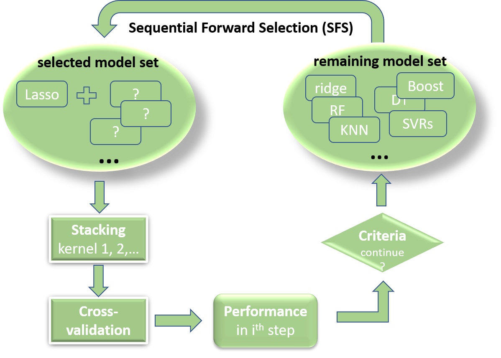

# House-Prices-Advanced-Regression-Techniques
A demostration of Sequential Forward Selection (SFS) model stacking.

The goal of this project was to use EDA, data cleaning and preprocessing, as well as advanced model-ensemble methods to predict house prices given 80 features of houses (data originally available on [Kaggle](https://www.kaggle.com/c/house-prices-advanced-regression-techniques)). Ten linear and nonlinear models were evaluated, e.g., Lasso was used to predict sale prices and to show which features are important to the house prices.

Model ensemble can further improve generalizability and robustness over a single model, i.e., to make a more robust model by combining the predictions of several base estimators. Compared with a simple model blending (easy to implement), in which coefficients are empirically chosen for each base model, model stacking (or stacking regressor) enables such coefficients computed at a secondary level model. It thus allows for better performance. 

However, using all available base models in a stacked model is not a good idea. (This will be demonstrated in the final evaluation section). On the other hand, it is computationally expensive to evaluate all possible combinations of stacked models. Here, we use a heuristic algorithm, sequential forward selection (SFS), aiming to find a (sub)optimal solution for the model stacking. See the figure below.

    </a>

For demonstration purpose, three Jupyter notebooks were used to cover the following three main sections: EDA, data preprocessing, and model evaluation.

1. Exploratory Data Analysis
    + Load data
    + Numerical and categorical features
    + Features with missing values
    + Relation of features to target (sale price)
    + Save cleaned data for further analysis

2. Data preprocessing
    + Load cleaned data
    + Numerical features: reducing skewness
    + Categorical features: converting to numerical (option A and B)
    + Merging numerical and categorical data
    + Standardization train and test data
    + Save preprocessed data for further analysis

3. Model evaluation
    + Load preprocessed data
    + Modeling (linear and nonlinear models)
    + Comparison amongst models
    + Correlation of model predictions
    + Sequential Forward Selection (SFS) model stacking
    + Final evaluation
______________________________

The final testing performance evaluated by Kaggle is shown below.

Single best model (Lasso): 0.12725

All model stacking (final = Lasso): 0.12349

All model stacking (final = Ridge): 0.12436

SFS-model stacking (final = Lasso): 0.12284

SFS-model stacking (final = Ridge): 0.12264 (best)

